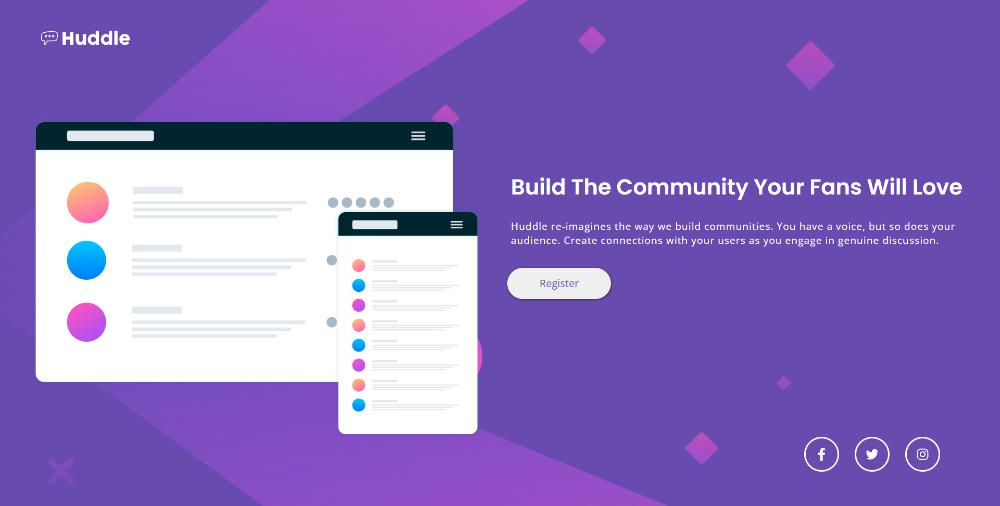

# Frontend Mentor - Huddle landing page with single introductory section solution

This is a solution to the [Huddle landing page with single introductory section challenge on Frontend Mentor](https://www.frontendmentor.io/challenges/huddle-landing-page-with-a-single-introductory-section-B_2Wvxgi0). Frontend Mentor challenges help you improve your coding skills by building realistic projects. 

## Table of contents

- [Overview](#overview)
  - [The Challenge](#the-challenge)
  - [Screenshot](#screenshot)
  - [Links](#links)
- [My process](#my-process)
  - [Built with](#built-with)
  - [What I learned](#what-i-learned)
  - [Continued development](#continued-development)

## Overview

### The Challenge

Users should be able to:
- View the optimal layout for the page depending on their device's screen size
- See hover states for all interactive elements on the page

### Screenshot

### Links

- Solution URL: [Huddle Landing Page](https://www.frontendmentor.io/solutions/huddle-landing-page-using-flexbox-qV3ZeFQob)
- Live Site URL (hosted on Heroku - may load slow): [Huddle Landing Page](https://huddlelp.herokuapp.com/)

## My process

I started off with laying out the website for desktop users first, I then realized after having a lot of the site done to make it fully responsive I wanted to make it mobile friendly first and then add the complexity later for desktop. So I ended up redoing the entire css, and came out with the product that is live now!

### Built with

- HTML
- CSS
- Flexbox
- [React](https://reactjs.org/) - JS library

### What I learned

This site helped me learn a lot about reposive design, and being able to build the site for all resolutions. I made this site 100% responsive for anyone to enjoy.

### Continued development

I feel that I want to continue working on my skills with flexbox, and learning the positioning attrivutes.
